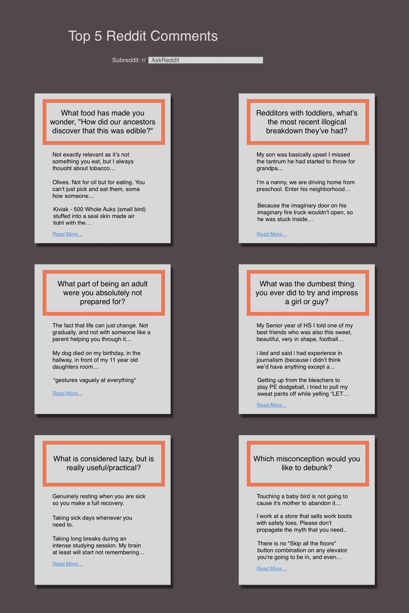
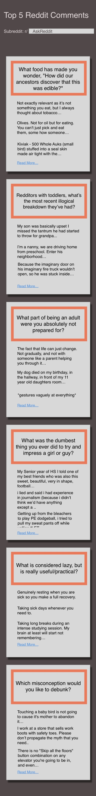

## Reddit API React

### Design




### Things to know for Implementation

##### API JSON calls

**Axios** or fetch

API call to Get top 6 posts urls

```
var childArray;
fetch("https://www.reddit.com/r/askreddit/top/.json")
.then(data=>data.json())
.then(data => {
	childArray = data.data.children
})

// childArray is an array of top posts
// useful properties: data.url and data.title

var postArray = [];
for (i=0; i<3; i++){
	postArray.push({
    title: childArray[i].data.title,
    url: childArray[i].data.url
  })
}

// fetch post url
fetch(postArray[0].url+".json")
.then(response=>response.json())
.then(response=>console.log(response))
// logs an array of 2 objects, index 0 being post info, index 1.data.children[i] being the post comments. The comment is nested in .data.body

var commentsArray = []
fetch(postArray[0].url+".json")
.then(response=>response.json())
.then(response=> {
  for(i=0; i<3; i++){
    commentsArray.push(response[1].data.children[i].data.body)
  }
  })

  // commentsArray is an array of the top [i] comments

  // will need to be able to display sliced comment string & full comment string
```

Array of API calls to top 5 comments


##### React components

Input

Info square
